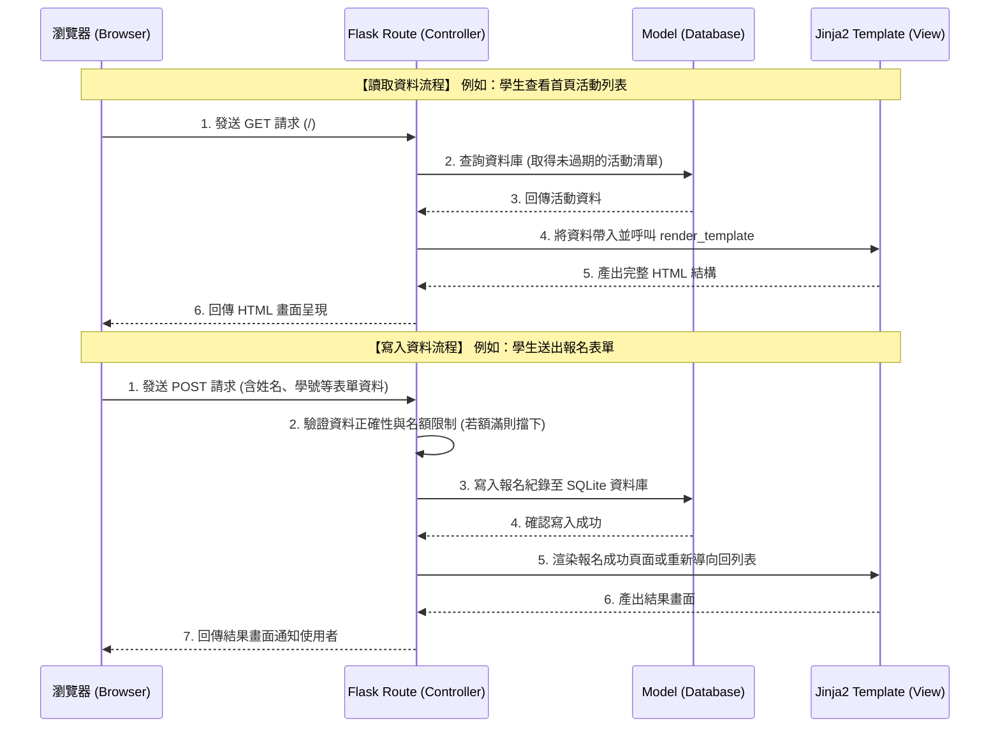

# 系統架構文件 (Architecture)：課外活動報名系統

## 1. 技術架構說明

本系統基於 **Python + Flask** 框架打造，主要依循 **MVC (Model-View-Controller)** 設計模式來分離邏輯、資料與呈現層。

- **選用技術與原因**：
  - **後端 (Flask)**：輕量且彈性高，適合快速開發中小型專案，能迅速建立起 MVP。
  - **資料庫 (SQLite)**：不需要額外架設與維護資料庫伺服器，檔案型儲存便於本地端開發與測試，足以應付初期大學生社團活動規模的資料量。
  - **模板引擎 (Jinja2)**：直接整合在 Flask 中，能方便地將後端資料注入 HTML，避免初期過度設計（無需處理複雜的前後端分離 API 及 CORS 跨域問題）。

- **MVC 模式在系統中的對應與職責**：
  - **Model (資料模型)**：負責定義資料庫的結構（如 `User`、`Activity`、`Registration`）與直接對 SQLite 進行 CRUD (新增/讀取/更新/刪除) 操作。
  - **View (視圖/模板)**：使用 Jinja2 引擎，負責 HTML 頁面的渲染。將 Controller 整理好的資料以網頁的形式呈現給使用者。
  - **Controller (控制器/路由)**：即 Flask 的 Routes，負責接收來自瀏覽器的 HTTP Request (GET/POST)，進行權限檢查與業務邏輯處理（如判斷是否額滿）後，調用 Model 存取資料，最後回傳相對應的 View 給使用者。

## 2. 專案資料夾結構

本專案採用結構化的 Flask 資料夾配置，讓程式碼易於維護及擴充。

```text
web_app_development/
├── app.py                 ← 系統進入點 (啟動 Flask 伺服器)
├── requirements.txt       ← 記錄 Python 套件依賴清單
├── docs/                  ← 文件存放區
│   ├── PRD.md             ← 產品需求文件
│   └── ARCHITECTURE.md    ← 系統架構文件 (本文件)
├── instance/              ← 不進入 Git 版控的實例資料夾
│   └── database.db        ← SQLite 資料庫檔案
└── app/                   ← 核心應用程式模組
    ├── __init__.py        ← Flask 應用程式初始化、配置與藍圖註冊
    ├── models/            ← Model: 資料庫模型定義
    │   └── models.py      ← 定義活動、使用者、報名紀錄等資料表
    ├── routes/            ← Controller: 路由與業務邏輯
    │   ├── main.py        ← 前台路由 (首頁、活動列表、活動報名頁)
    │   └── admin.py       ← 後台路由 (活動管理、報名名單檢視)
    ├── templates/         ← View: Jinja2 HTML 模板
    │   ├── base.html      ← 基礎模板 (共用的 Header、Footer、導覽列)
    │   ├── index.html     ← 首頁與活動列表畫面
    │   ├── activity.html  ← 單一活動詳細介紹與報名表單
    │   └── admin/         ← 後台相關頁面
    │       ├── dashboard.html
    │       └── participants.html
    └── static/            ← CSS / JS / 圖片等前端靜態資源
        ├── css/
        │   └── style.css  ← 核心樣式檔
        └── js/
            └── script.js  ← 前端互動腳本
```

## 3. 元件關係圖

以下展示使用者操作時，系統各元件之間的互動流程：



## 4. 關鍵設計決策

1. **採用 SSR (伺服器端渲染) 而非 SPA (單頁面應用)**
   - **原因**：本系統以表單提交與活動資訊展示為主，不涉及極度複雜的前端互動。使用 Flask + Jinja2 可以在伺服器端直接將 HTML 組合完成，不僅減輕前端負擔、增進開發速度，也利於活動頁面的 SEO 搜尋排名。
2. **前後台路由分離 (Blueprints)**
   - **原因**：利用 Flask Blueprints 將一般學生的前台頁面 (`routes/main.py`) 與管理者的後台頁面 (`routes/admin.py`) 進行模組化拆分。這樣做能讓權限控管更容易（例如針對 `admin` 藍圖底下的所有路由統一加上登入驗證攔截），且能確保專案架構清晰、利於多人協作。
3. **選用 SQLite 作為初期資料庫**
   - **原因**：目前系統為「大學生課外活動」級別，屬於中小型應用，沒有鉅額的分散式存取需求。SQLite 不須額外架設與維護資料庫伺服器，部署與備份都相當容易，能最快達到 MVP 階段的目標。未來若規模擴大，也能輕易將資料庫引擎抽換為 PostgreSQL 或 MySQL。
4. **將業務邏輯封裝在 Controller (Routes)**
   - **原因**：確保 Model 純粹負責與資料庫的 Mapping 與基本存取，而將「判斷報名人數是否額滿」、「驗證使用者輸入資料是否合規」等商業邏輯保留在 Controller 中。這樣可以讓各層的職責更加單一，日後如果邏輯變更，能更直覺地在 Route 中找到對應的程式碼。
