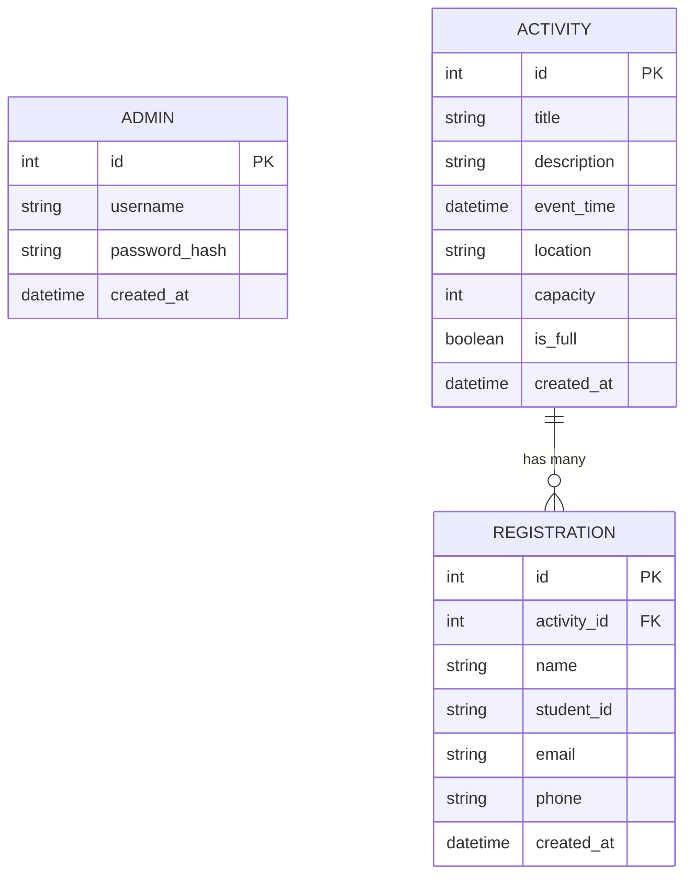

# 資料庫設計文件 (DB Design)：課外活動報名系統

## 1. ER 圖（實體關係圖）

根據系統需求，資料庫主要包含三張資料表：`admins`（管理者）、`activities`（活動）、與 `registrations`（報名紀錄）。

## 2. 資料表詳細說明

### 2.1. `admins` (管理者資料表)
存放系統管理員的帳號與密碼，用於後台登入驗證。

| 欄位名稱 | 型別 | 說明 | 約束 (Constraints) |
| :--- | :--- | :--- | :--- |
| `id` | INTEGER | 唯一識別碼 | PRIMARY KEY, AUTOINCREMENT |
| `username` | TEXT | 登入帳號 | NOT NULL, UNIQUE |
| `password_hash` | TEXT | 雜湊加密後的密碼 | NOT NULL |
| `created_at` | DATETIME | 帳號建立時間 | DEFAULT CURRENT_TIMESTAMP |

### 2.2. `activities` (活動資料表)
存放所有建立的課外活動資訊。

| 欄位名稱 | 型別 | 說明 | 約束 (Constraints) |
| :--- | :--- | :--- | :--- |
| `id` | INTEGER | 活動唯一識別碼 | PRIMARY KEY, AUTOINCREMENT |
| `title` | TEXT | 活動名稱 | NOT NULL |
| `description` | TEXT | 活動簡介 |  |
| `event_time` | DATETIME | 活動舉辦時間 | NOT NULL |
| `location` | TEXT | 活動地點 | NOT NULL |
| `capacity` | INTEGER | 報名人數上限 | NOT NULL |
| `is_full` | BOOLEAN | 是否已達人數上限 | DEFAULT 0 (False) |
| `created_at` | DATETIME | 活動建立時間 | DEFAULT CURRENT_TIMESTAMP |

### 2.3. `registrations` (報名紀錄資料表)
存放學生的報名資料，與 `activities` 資料表為多對一關係。

| 欄位名稱 | 型別 | 說明 | 約束 (Constraints) |
| :--- | :--- | :--- | :--- |
| `id` | INTEGER | 報名紀錄唯一識別碼 | PRIMARY KEY, AUTOINCREMENT |
| `activity_id` | INTEGER | 關聯的活動 ID | FOREIGN KEY 參考 `activities(id)` |
| `name` | TEXT | 學生姓名 | NOT NULL |
| `student_id` | TEXT | 學生學號 | NOT NULL |
| `email` | TEXT | 聯絡信箱 | NOT NULL |
| `phone` | TEXT | 聯絡電話 | NOT NULL |
| `created_at` | DATETIME | 報名送出時間 | DEFAULT CURRENT_TIMESTAMP |

## 3. SQL 建表語法
完整的 CREATE TABLE 語法已獨立儲存於專案內的 `database/schema.sql`，開發時可直接執行此檔案初始化 SQLite 資料庫。

## 4. Python Model 程式碼
根據先前的架構設計，為了保持專案輕量，將採用原生的 `sqlite3` 實作資料操作邏輯。
所有的 Model 類別與 CRUD 方法實作已建立於 `app/models/models.py` 中。包含了 `ActivityModel`、`RegistrationModel` 與 `AdminModel` 的相關實作。
