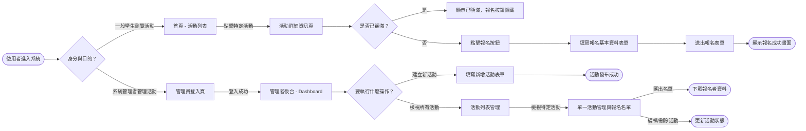
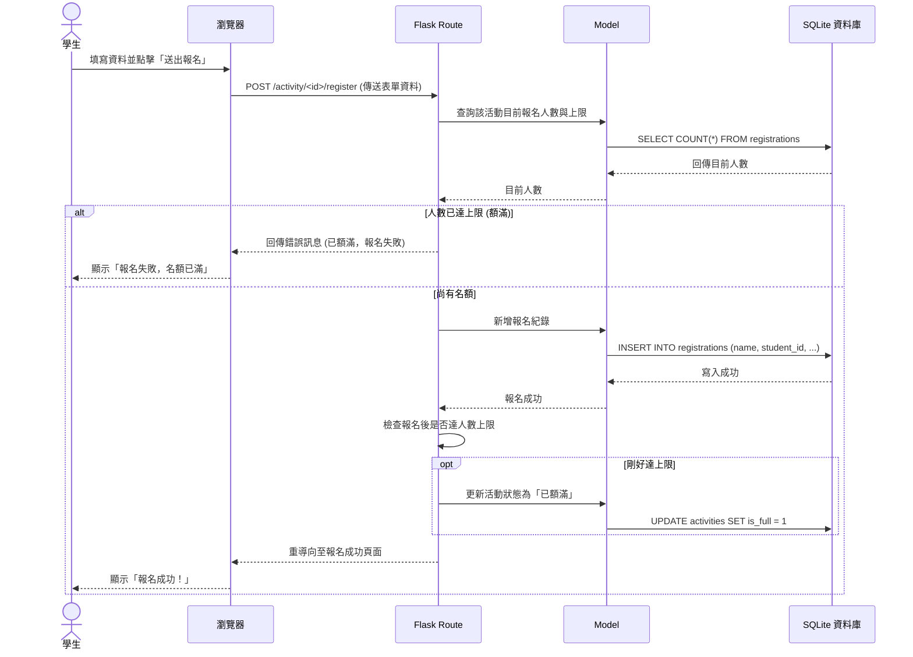

# 流程圖文件 (Flowchart)：課外活動報名系統

## 1. 使用者流程圖 (User Flow)

本流程圖展示了兩類主要使用者（一般學生與管理者）在系統中的操作路徑。

## 2. 系統序列圖 (Sequence Diagram)

本圖描述學生「送出報名表單」到「資料存入資料庫」的完整後端處理流程，特別展示了額滿檢查的機制。

## 3. 功能清單對照表

根據 PRD 定的功能需求，以下為系統預計實作的 URL 路徑與 HTTP 方法對照表。

| 功能描述 | 身分 | HTTP 方法 | URL 路徑 (建議) | 說明 |
| :--- | :--- | :--- | :--- | :--- |
| **首頁與活動列表** | 學生 | GET | `/` | 顯示所有開放中的活動 |
| **活動詳細資訊** | 學生 | GET | `/activity/<id>` | 顯示單一活動內容、剩餘名額與報名表單 |
| **送出報名表單** | 學生 | POST | `/activity/<id>/register` | 接收學生基本資料並存入資料庫 |
| **管理員登入** | 管理員 | GET/POST | `/admin/login` | 後台登入頁面與登入驗證處理 |
| **管理者後台首頁** | 管理員 | GET | `/admin` | 顯示所有活動狀態的 Dashboard |
| **建立新活動頁面** | 管理員 | GET | `/admin/activity/new` | 顯示新增活動的表單 |
| **新增活動 (處理)** | 管理員 | POST | `/admin/activity/new` | 接收表單資料並寫入資料庫 |
| **編輯活動** | 管理員 | GET/POST | `/admin/activity/<id>/edit` | 修改現有活動資訊 |
| **刪除/取消活動** | 管理員 | POST | `/admin/activity/<id>/delete` | 刪除或下架該活動 |
| **檢視報名名單** | 管理員 | GET | `/admin/activity/<id>/participants`| 查看該活動的所有報名者詳細資料 |
